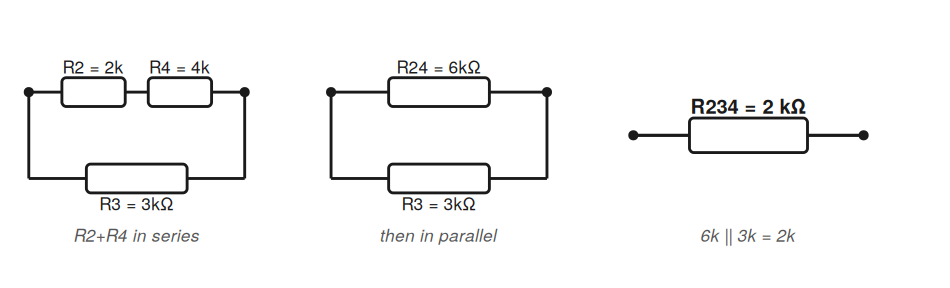

# Chapter 2.1 — Electrical Circuits and Components

> ME 435 · Mechatronics — Self-study companion notes.
> **Read these alongside the lecture slides.** The slides carry the figures, graphs, and circuit schematics; these notes carry the explanations and the *derivations* — the "where does this equation come from" reasoning we work through in class.

## Learning Objectives

By the end of this chapter you should be able to:

- Explain voltage, current, and resistance, and why circuit analysis reduces to finding $V$ and $I$.
- Derive and use the voltage–current relationship of each passive element (resistor, capacitor, inductor).
- Apply **Ohm's law** and **Kirchhoff's voltage/current laws (KVL/KCL)**.
- Derive the equivalent element for series and parallel combinations of R, C, and L.

---

## 1. The Big Picture: It's All About $V$ and $I$

Analyzing a circuit ultimately comes down to finding two quantities: **voltage ($V$)** and **current ($I$)**. Understanding any mechatronic system means knowing these two values throughout its circuits.

The single idea that ties this whole chapter together:

> **Every circuit element defines its own relationship between $V$ and $I$.**
> The resistor, capacitor, and inductor each have a *different* _V_–_I_ relationship — and that relationship *is* what the element "is." Once you know an element's _V_–_I_ rule, you can plug it into Kirchhoff's laws and solve any circuit.

| Quantity | Symbol | Unit | Meaning |
|----------|:------:|:----:|---------|
| Voltage | $V$ | volt (V) | Potential difference between two points — the "push" |
| Current | $I$ | ampere (A) | Flow of electric charge |
| Resistance | $R$ | ohm ($\Omega$) | Opposition to current flow |

**DC vs. AC:**
- **DC** — voltage and current are constant in time (e.g., a battery).
- **AC** — voltage and current vary with time (e.g., a wall outlet).

---

## 2. The Circuit: Source and Load

- **Voltage source** — provides energy to the circuit (battery, power supply, generator). Conventional current flows from the **+** terminal, through the circuit, back to the **−** terminal.
- **Load** — a network of elements that *dissipates* or *stores* electrical energy (e.g., a bulb, or a system doing useful work).

> ⚠️ **Key misconception — current direction.**
> By historical convention, *conventional current* flows from **+** to **−**. But in a metal wire it is the **electrons (negative charge)** that actually move — in the *opposite* direction. The convention was fixed in the 1700s, before electrons were understood, and we still keep it today.
> **Positive charges do not move — electrons do.**

---

## 3. The Three Basic Passive Elements

There are three basic **passive** elements, each defined by its own _V_–_I_ relationship:

| Element | Symbol | Role | Energy |
|---------|:------:|------|--------|
| **Resistor** | $R$ | Converts electrical energy to heat | Dissipates |
| **Capacitor** | $C$ | Builds an **electric** field between plates | Stores |
| **Inductor** | $L$ | Builds a **magnetic** field around a coil | Stores |

The three sections below each follow the same pattern: *what it is → its _V_–_I_ relationship → where that relationship comes from.*

---

### 3.1 Resistor

A resistor is a **dissipative** element that converts electrical energy into heat. Unit: ohm ($\Omega$).

**Ohm's law** — the _V_–_I_ relationship of an ideal resistor:

$$V = I R$$

For an *ideal* resistor, $V$ and $I$ are perfectly **linear**: a straight line through the origin with slope $R$. Real resistors deviate from this — for example, resistance drifts with temperature, so the line bends at high power.
*(See the "Real vs. Ideal" _V_–_I_ graph on the slides.)*

**Resistivity — why resistance depends on the wire itself.** Resistance is not just a number you pick; it comes from material and geometry:

$$R = \frac{\rho L}{A}$$

- $\rho$ — the material's **resistivity** (intrinsic property)
- $L$ — length of the wire → longer means electrons travel through more material → **more** resistance
- $A$ — cross-sectional area → thicker wire gives charge more room to flow → **less** resistance

> Silver has the lowest resistivity, with copper close behind. Because copper is far cheaper, it is the most common material for real wiring — a balance of **conductivity and cost**.

**Reading color bands** (standard 4-band resistor) — *see the color chart on the slides:*

| Band | Meaning |
|:----:|---------|
| 1st | First digit |
| 2nd | Second digit |
| 3rd | Multiplier (power of 10) |
| 4th | Tolerance |

---

### 3.2 Capacitor

A capacitor is a passive element that stores energy in an **electric field**. The simplest form is two parallel conducting plates separated by a dielectric. Opposite charges accumulate on the plates, creating a field that maintains a voltage difference. Unit: **farad (F)**.

**The defining relationship — and where it comes from.**
A capacitor's stored charge is proportional to the voltage across it, with capacitance $C$ as the constant:

$$q = C v$$

Current is the rate at which charge flows ($i = dq/dt$). Differentiating $q = Cv$ (with $C$ constant):

$$i = \frac{dq}{dt} = \frac{d(Cv)}{dt} = C \frac{dv}{dt}$$

So **the current through a capacitor is proportional to how *fast* its voltage changes** — not to the voltage itself.

**Key behavior — blocks DC, passes AC.** This falls right out of the equation. At steady DC the voltage is constant, so $dv/dt = 0 \Rightarrow i = 0$: the capacitor acts like an **open circuit**. For a fast-changing AC signal, $dv/dt$ is large, so it readily passes current.

> 💡 Capacitors are used to **control and stabilize voltage** in a circuit (they resist sudden voltage changes).

> ⚠️ **Misconception — "current flows through a capacitor."**
> Strictly, DC does **not** flow *through* a capacitor. Charge is *displaced* — pushed onto one plate and pulled off the other through the external circuit — building up the electric field. The charge movement in the surrounding wires is what we observe as "current."

---

### 3.3 Inductor

An inductor is a passive element that stores energy in a **magnetic field**. In its simplest form it is a coil of wire. Unit of inductance: **henry (H)**.

**The governing principle — Faraday's law.** A *changing* magnetic field induces a voltage that **opposes the change in current** that created it. This "opposition to change" is the defining behavior of an inductor.

**The defining relationship — and where it comes from.**
*Magnetic flux* (how much magnetic field passes through the coil) is proportional to the current, with inductance $L$ as the constant:

$$\lambda = L i$$

By Faraday's law the induced voltage equals the rate of change of flux:

$$v = \frac{d\lambda}{dt} = \frac{d(Li)}{dt} = L \frac{di}{dt}$$

So **the voltage across an inductor is proportional to how *fast* its current changes** — the mirror image of the capacitor.

**Key behavior — resists sudden current changes.** Because $v = L di/dt$, forcing the current to change instantly would require infinite voltage. So inductor current **cannot jump** — it builds up gradually, at a rate set by $L$. *(The slide simulation shows this gradual current rise.)*

> 💡 Inductors are used to **control and stabilize current** (e.g., the inductor in a buck converter stepping 12 V down to 5 V).

---

### 3.4 Passive Components — Wrap-Up

Notice the **mirror symmetry** between capacitor and inductor: swap $v \leftrightarrow i$ and $C \leftrightarrow L$ and one equation becomes the other.

| | Resistor | Capacitor | Inductor |
|---|:---:|:---:|:---:|
| **Role** | Dissipative element | Stores energy in an **electric** field | Stores energy in a **magnetic** field |
| **_V_–_I_ relationship** | $V = IR$ | $i = C \dfrac{dv}{dt}$ | $v = L \dfrac{di}{dt}$ |
| **At steady DC** | normal resistor | open circuit | short circuit |
| **Stabilizes** | — | voltage | current |

---

## 4. Kirchhoff's Laws

Kirchhoff's laws are the foundation of **all** circuit analysis — from a single loop to transistor circuits, op-amps, and ICs with hundreds of elements. (Think of them as "Newton's laws for circuits.")

### 4.1 Kirchhoff's Voltage Law (KVL)

> **The sum of voltages around any closed loop equals zero.**

$$\sum_{\text{loop}} V = 0$$

The physical meaning: as you travel once around a closed loop and return to the start, you must be back at the same potential. So every voltage *rise* (from sources) is exactly cancelled by the voltage *drops* across the elements — **energy is conserved**.

**How to apply it — the thinking flow:**

1. **Assume a current direction** on each branch and draw an arrow. (Your guess does not have to be right — see §4.3.)
2. **Assign voltage polarity** to each passive element, consistent with that arrow: the voltage *drops* in the direction the current flows (enter at **+**, leave at **−**).
3. **Walk the loop, add up the voltages with their signs, set the total to 0**, then solve for the unknown.

### 4.2 Kirchhoff's Current Law (KCL)

> **The sum of all currents entering and leaving a node equals zero.**

$$\sum_{\text{node}} I = 0$$

The physical meaning: charge cannot pile up at a junction, so whatever flows *in* must flow *out*. **Convention:** currents *entering* a node are positive; currents *leaving* are negative (or vice versa — just stay consistent).

### 4.3 You Can Guess Current Directions Freely

When analyzing a circuit you **arbitrarily** choose current directions and draw arrows; the assumed voltage polarities just have to stay consistent with those arrows.

> 💡 If your guess is wrong, you do **not** start over — the math simply returns a **negative value**, telling you the real current flows the other way. Consistent KVL/KCL gives the correct result no matter which direction you guessed.

---

## 5. Series and Parallel Combinations

This is where the element equations from §3 meet the laws from §4. Each result below is *derived*, not just stated — follow the logic, don't memorize the formula.

### 5.1 Series — same current through every element (Solution of Take home example 1)

In a series connection there is only one path, so the **same current** flows through every element.

**Resistors (from KVL).** The source voltage is split across the two resistors:

$$V = V_1 + V_2 = iR_1 + iR_2 = i (R_1 + R_2)
\quad\Longrightarrow\quad \boxed{R_{eq} = R_1 + R_2}$$

**Capacitors.** The same current means the **same charge $q$** accumulates on each capacitor. Each holds voltage $v = q/C$, and the voltages add:

$$V = \frac{q}{C_1} + \frac{q}{C_2} = q\left(\frac{1}{C_1} + \frac{1}{C_2}\right)
\quad\Longrightarrow\quad \boxed{\frac{1}{C_{eq}} = \frac{1}{C_1} + \frac{1}{C_2}}$$

**Inductors.** The same current $i$ flows through both, so the voltages (each $L di/dt$) add:

$$V = L_1\frac{di}{dt} + L_2\frac{di}{dt} = (L_1 + L_2)\frac{di}{dt}
\quad\Longrightarrow\quad \boxed{L_{eq} = L_1 + L_2}$$

### 5.2 Parallel — same voltage across every element (Solution of Take home example 1)

In a parallel connection both elements connect to the same two nodes, so they share the **same voltage**.

**Resistors (from KCL).** The total current splits between the two branches:

$$i = i_1 + i_2 = \frac{V}{R_1} + \frac{V}{R_2} = V\left(\frac{1}{R_1} + \frac{1}{R_2}\right)
\quad\Longrightarrow\quad \boxed{\frac{1}{R_{eq}} = \frac{1}{R_1} + \frac{1}{R_2}}$$

**Capacitors.** Same voltage $V$, so each stores $q = CV$, and the charges add:

$$q = C_1 V + C_2 V = (C_1 + C_2) V
\quad\Longrightarrow\quad \boxed{C_{eq} = C_1 + C_2}$$

**Inductors.** Same voltage $V$ across both; the branch currents add ($di/dt = V/L$ for each):

$$\frac{di}{dt} = \frac{V}{L_1} + \frac{V}{L_2} = V\left(\frac{1}{L_1} + \frac{1}{L_2}\right)
\quad\Longrightarrow\quad \boxed{\frac{1}{L_{eq}} = \frac{1}{L_1} + \frac{1}{L_2}}$$

### 5.3 The Pattern

> **Resistors and inductors** combine the same way — **add in series, reciprocal in parallel**.
> **Capacitors are the opposite** — **reciprocal in series, add in parallel**.
> The reason traces straight back to the element equations: $R$ and $L$ relate voltage to current the "same way round," while $C$ relates *charge* to voltage, flipping the roles.

| | Series | Parallel |
|---|:---:|:---:|
| **R** | $R_1 + R_2$ | $\dfrac{1}{R_1}+\dfrac{1}{R_2}$ |
| **L** | $L_1 + L_2$ | $\dfrac{1}{L_1}+\dfrac{1}{L_2}$ |
| **C** | $\dfrac{1}{C_1}+\dfrac{1}{C_2}$ | $C_1 + C_2$ |

---

## Solution — Take-Home Example 2

**Problem.** Compute $V_{out}$ and $I_{out}$ for the circuit with
$R_1=1,\ R_2=2,\ R_3=3,\ R_4=4,\ R_5=5,\ R_6=6\ \text{k}\Omega$, $V_1=10\ \text{V}$, $V_2=20\ \text{V}$.

We solve it the way we do in class: **shrink the resistor network step by step, redraw, then apply KVL loop by loop.**

### Step 1 — Collapse the resistor network, one piece at a time

**Top path.** $R_2$ and $R_4$ sit in series along the top:

$$R_{24} = R_2 + R_4 = 2 + 4 = 6\ \text{k}\Omega$$

**That top path is in parallel with $R_3$:**

$$R_{234} = R_{24}\parallel R_3 = \frac{R_{24}\cdot R_3}{R_{24}+R_3} = \frac{6\cdot 3}{6+3} = \frac{18}{9} = 2\ \text{k}\Omega$$

  

<em>Reducing the top path: $R_2+R_4$ in series (6 kΩ), then in parallel with $R_3$ (3 kΩ) → $R_{234}=2$ kΩ.</em>

**On the right, $R_5$ and $R_6$ are in parallel:**

$$R_{56} = R_5\parallel R_6 = \frac{R_5\cdot R_6}{R_5+R_6} = \frac{5\cdot 6}{5+6} = \frac{30}{11}\approx 2.7\ \text{k}\Omega$$

Now the whole circuit collapses into something simple: on the **left** a loop with $V_1$ (10 V) and $R_1$; across the **top** the block $R_{234}$ with $V_{out}$ on its right side; on the **right** the block $R_{56}$; and $V_2$ (20 V) closing the bottom. Two clean loops.

  

<em>The circuit after reduction — Loop 1 (left) gives $I_{out}$; Loop 2 (right) gives the loop current and $V_{out}$.</em>

### Step 2 — Loop 1 (left loop) → $I_{out}$

The left loop is just $V_1$ driving $R_1$. KVL around it:

$$\sum V = 0:\quad V_1 - I_1 R_1 = 0 \;\Rightarrow\; 10 = I_1\ (1000)$$

$$\boxed{I_{out} = I_1 = \frac{10}{1000} = 0.01\ \text{A} = 10\ \text{mA}}$$

That's it for $I_{out}$ — the left loop stands alone.

### Step 3 — Loop 2 (right loop) → the loop current

Assume a current $I_{56}$ circulating around the right loop and write KVL. Going around the loop, $V_1$ is a rise, the two resistor blocks are drops, and $V_2$ opposes us:

$$10 - V_{234} - V_{56} - 20 = 0$$

Replace each resistor voltage with Ohm's law ($V = I_{56}R$):

$$10 - I_{56}R_{234} - I_{56}R_{56} - 20 = 0$$

$$I_{56}\ (R_{234} + R_{56}) = -10 \;\Rightarrow\; I_{56} = \frac{-10}{2 + 2.7} = \frac{-10}{4.7\ \text{k}\Omega} \approx -2.1\ \text{mA}$$

> ⚠️ **Notice the minus sign — this is the lesson from §4.3 in action.**
> We *guessed* the current direction, and the negative result is the circuit telling us our guess was backwards: the real current flows the **other way**, with magnitude about 2.1 mA. We don't redo anything — the sign carries the correction. (This makes sense physically: the 20 V source is stronger than the 10 V source, so it pushes current "upstream" against our assumed arrow.)

### Step 4 — $V_{out}$

$V_{out}$ is the voltage at the node on the right of $R_{234}$. Walk from the 10 V node through $R_{234}$ to that node:

$$V_{out} = 10 - V_{234} = 10 - I_{56}R_{234} = 10 - (-2.1\ \text{mA})(2\ \text{k}\Omega) = 10 + 4.2$$

$$\boxed{V_{out} \approx 14.2\ \text{V}}$$

*(Using the exact $R_{56} = \tfrac{30}{11}\ \text{k}\Omega$ instead of the rounded 2.7 gives $V_{out} = \tfrac{370}{26} = 14.23\ \text{V}$ — the small difference is just rounding.)*

### The intuition

$V_{out}$ ends up **higher than 10 V** because it sits between a 10 V source and a stronger 20 V source — the 20 V side pulls the node up above 10 V. And $I_{out}$ was easy because the left loop is independent: $V_1$ sits right across $R_1$, so $I_{out} = V_1/R_1$ with no other algebra needed.

---

## Key Takeaways

- Circuit analysis reduces to finding $V$ and $I$; **each element defines its own _V_–_I_ relationship**.
- Conventional current flows + → −, but **electrons move the other way**.
- The element equations come from simple definitions: Ohm's law ($V=IR$), $q=Cv \Rightarrow i = C dv/dt$, and $\lambda = Li \Rightarrow v = L di/dt$.
- A capacitor **blocks DC / passes AC** and **stabilizes voltage**; an inductor **resists sudden current changes** and **stabilizes current** — they are mirror images.
- **KVL** (loop voltages sum to 0) and **KCL** (node currents sum to 0) plus the element equations let you derive *everything*, including the series/parallel rules.
- Guessing a current direction wrong just gives a **negative answer** — not an error, as long as you stay consistent.

---

## Course Materials

- 📊 Slides: [Chapter 2.1 — Electrical Circuits and Components](../slides/)
